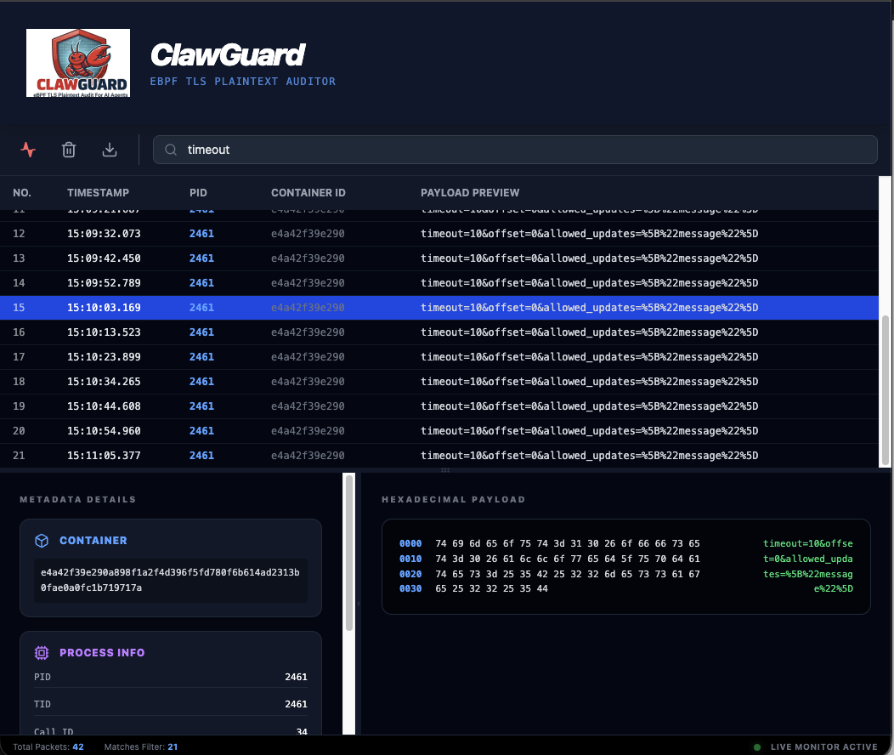

# ClawGuard


**Cloud-native eBPF sidecar that observes AI-agent TLS plaintext from outside the container** — hooks OpenSSL and Go `crypto/tls` *before encryption*, with no MITM, no agent image changes, and no rewrite of the live write buffer.

ClawGuard is an **observe-and-persist** tool: it captures full logical writes, exports them through hot-loaded plugins (default: JSONL file), and exposes Prometheus metrics for ops. It does **not** modify what the agent sends on the wire and does **not** block connections.

---

## Capabilities (what works today)

| Capability | Detail |
|------------|--------|
| **TLS plaintext capture** | Uprobes on OpenSSL `SSL_write` / `SSL_write_ex` and Go 1.21+ `crypto/tls.(*Conn).Write` (amd64/arm64) |
| **Full write reassembly** | Streaming `bpf_loop` + userspace chunk pool; default **unlimited** per logical write (optional `CLAWGUARD_MAX_CAPTURE_BYTES` safety valve). Verified end-to-end at ≥2MiB |
| **Zero agent change** | Select targets by Docker **label** or Kubernetes **annotation**; privileged DaemonSet / sidecar style deploy |
| **Persist plaintext** | Default **file sink** (also the **plugin reference example**) → JSONL at `/var/log/clawguard/plaintext.jsonl`. See [`cmd/clawguard-sink-file`](cmd/clawguard-sink-file) |
| **Ops metrics** | Prometheus `:8080/metrics` + Grafana dashboard JSON |
| **Hot-load plugins** | Out-of-process sinks/processors (JSON RPC). Ship extra binaries into `plugin_dir`; **SIGHUP** reloads without detaching eBPF |
| **Observational detect** | Default-on async `detect` processor (side-path; does not block capture or file sink) |
| **Optional exports** | OTLP logs (`otel` sink), debug Web UI (`debugws` on `:8081`) |

**Not in scope of this tree:** changing SSL buffers in place, TCP RST / traffic blocking, or bundled commercial storage backends. Those are separate extensions via the [plugin contract](docs/plugin-contract.md).

---

## Quick Start (Kubernetes + Grafana)

### 1. Deploy

```bash
kubectl apply -f deploy/kubernetes/rbac.yaml
kubectl apply -f deploy/kubernetes/daemonset.yaml
```

Monitor Pods with:

```yaml
metadata:
  annotations:
    clawguard.io/monitor: "true"
```

See [`deploy/kubernetes/example-monitored-pod.yaml`](deploy/kubernetes/example-monitored-pod.yaml).

### 2. Scrape metrics

`:8080/metrics` — key series:

| Metric | Meaning |
|--------|---------|
| `clawguard_ssl_writes_total` | Reassembled writes (`hook`, `truncated`) |
| `clawguard_ssl_write_bytes_total` | Captured plaintext bytes |
| `clawguard_attached_targets` | Active uprobe targets |
| `clawguard_build_info` / `clawguard_plugin_info` | Host / plugin versions |
| `clawguard_sink_dropped_total` | Sink or async-processor queue drops |

Import [`deploy/grafana/clawguard-dashboard.json`](deploy/grafana/clawguard-dashboard.json).

### 3. Optional OTLP

Set `OTEL_EXPORTER_OTLP_ENDPOINT` (enables the `otel` sink plugin).

---

## Docker / single-host

```bash
docker pull eyelessly/clawguard:latest
mkdir -p ./clawguard-logs
docker rm -f clawguard 2>/dev/null
docker run -d --name clawguard \
  --privileged --pid=host \
  -p 8080:8080 \
  -v /var/run/docker.sock:/var/run/docker.sock \
  -v "$(pwd)/clawguard-logs:/var/log/clawguard" \
  -e CLAWGUARD_LABEL=clawguard.monitor=true \
  -e CLAWGUARD_DEBUG_UI=0 \
  eyelessly/clawguard:latest
```

Then:

```bash
# labeled workload
docker run --label clawguard.monitor=true ...

curl -s localhost:8080/metrics | grep clawguard_
ls -lh ./clawguard-logs/plaintext.jsonl   # full captured plaintext (JSONL)
```

E2E (Go/BPF compile **only inside Docker**):

```bash
./e2e/docker/run.sh          # OpenSSL smoke + file sink
./e2e/docker/run_large.sh    # ≥2MiB full body in e2e/out/large/plaintext.jsonl
./e2e/docker/run_go_tls.sh   # static Go crypto/tls
```

---

## How it fits together

```
Agent container                    ClawGuard host
───────────────                    ─────────────
SSL_write / Go TLS Write
        │
        ▼ uprobe (read-only copy)
   BPF ringbuf ──► reassembly ──► pipeline
                                      │
                         sync processors (optional mask)
                                      │
                    ┌─────────────────┼─────────────────┐
                    ▼                 ▼                 ▼
               file sink         otel sink         async detect
               (JSONL)           (OTLP)            (observe only)
```

- Capture path never waits on slow sinks (bounded queues; drops counted in metrics).
- Async processors (default `detect`) run on a side path after the event is queued to sinks.
- Requirements: **Linux ≥ 5.17** (`bpf_loop`), BTF (`/sys/kernel/btf/vmlinux`), privileged eBPF.

Default pipeline config: [`deploy/config/config.yaml`](deploy/config/config.yaml).

---

## Plugins

| Binary | Role |
|--------|------|
| `clawguard` | Host: eBPF, reassembly, plugin manager, `/metrics` |
| `clawguard-sink-file` | **Reference sink example** — plaintext JSONL (default on). Source: [`cmd/clawguard-sink-file`](cmd/clawguard-sink-file) |
| `clawguard-sink-otel` | OTLP logs |
| `clawguard-sink-debugws` | Debug UI/WS (default listen `:8081`) |
| `clawguard-processor-detect` | Async observational rules (default on) |
| `clawguard-processor-mask` | Sync storage-side mask (default **off**) |

To build your own sink, copy the file-sink example and follow [`docs/plugin-contract.md`](docs/plugin-contract.md).

- Plugin dir: `CLAWGUARD_PLUGIN_DIR` (`/var/lib/clawguard/plugins`)
- Config: `CLAWGUARD_CONFIG` (`/etc/clawguard/config.yaml`)
- `clawguard -version` / `<plugin> -version` for build identity

Debug UI: enable `debugws` or `CLAWGUARD_DEBUG_UI=1` (metrics stay on `:8080`).



---

## Configuration

| Env | Default | Description |
|-----|---------|-------------|
| `CLAWGUARD_CONFIG` | `/etc/clawguard/config.yaml` | Pipeline YAML |
| `CLAWGUARD_PLUGIN_DIR` | `/var/lib/clawguard/plugins` | Plugin binaries |
| `CLAWGUARD_PLAINTEXT_LOG` | _(config)_ | Override file sink path |
| `CLAWGUARD_LABEL` | _(none)_ | Docker `key=value` AND filter |
| `CLAWGUARD_POD_ANNOTATION` | `clawguard.io/monitor=true` | K8s annotation filter |
| `CLAWGUARD_RUNTIMES` | `openssl,go` | Which hooks to attach |
| `CLAWGUARD_MAX_CAPTURE_BYTES` | `0` (unlimited) | Optional capture size cap |
| `CLAWGUARD_CHUNK_POOL_MB` | `256` | Userspace fragment pool |
| `CLAWGUARD_REASSEMBLY_TTL` | `30s` | Incomplete reassembly timeout |
| `CLAWGUARD_PAYLOAD_PREVIEW_MAX` | `16384` | Stdout log preview only |
| `CLAWGUARD_DEBUG_UI` | _(config)_ | `1` / `0` toggles debugws |
| `CLAWGUARD_DEBUG` | _(off)_ | Verbose host logs |
| `OTEL_EXPORTER_OTLP_ENDPOINT` | _(empty)_ | Enables otel sink |
| `NODE_NAME` | _(K8s)_ | Downward API node name |
| `DOCKER_HOST` | `unix:///var/run/docker.sock` | Docker engine |

`KUBERNETES_SERVICE_HOST` set → Kubernetes mode; otherwise Docker mode.

---

## Build

Shippable binary/image: compile **inside Docker** (BPF):

```bash
docker build -t clawguard:local .
# or
make docker-build IMAGE=clawguard:local
```

Native Linux (clang, llvm, libbpf-dev, Go 1.22+, BTF):

```bash
make build
sudo ./bin/clawguard
```

---

## Limitations

- Not BoringSSL / Java SSLEngine; Node may use executable-symbol fallback when `libssl` is missing.
- Go: **1.21+**, **amd64/arm64**; unstripped / pclntab-available binaries preferred.
- Per-write ceiling is effectively the kernel `bpf_loop` budget (~512MiB at 512B chunks), not a 16KB product cap.
- Under backpressure (pool / ringbuf / TTL / full sink queues), events can drop or be marked `truncated`.
- Trace correlation uses plaintext `traceparent` when present (no eBPF Trace ID extraction yet).
- **Passive only**: does not alter or block the agent’s TLS send path.
